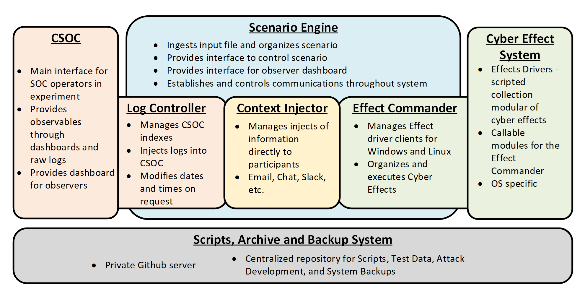
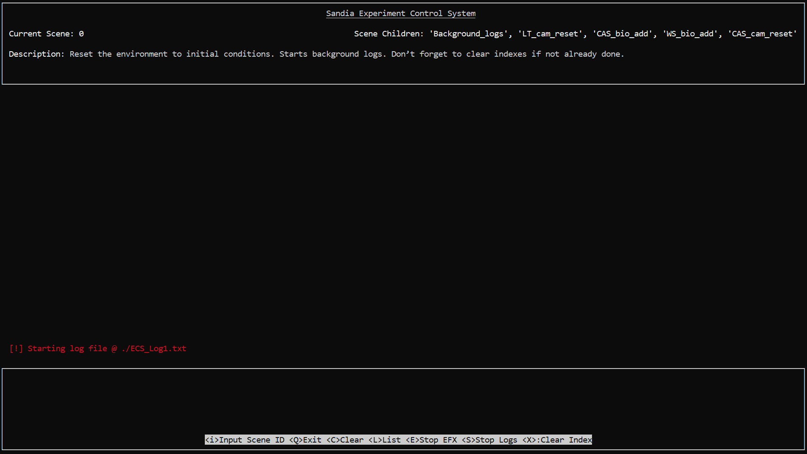

# Sandia Experiment Control System

The purpose of the Sandia Experimental Control System (ECS) is to provide a holistic cyber-physical environment for experiments on the response of organizations and their personnel to cyber-physical blended attacks. These experiments seek to produce a better understanding of the evolution, impact, and manifestation of blended cyber-physical attacks. The intended result is the development of scientifically proven, results driven, defenses against complex cyber and cyber-physical attacks against critical infrastructure and sensitive environments.   

### Capabilities
The ECS must provide the following capabilities:

1.	Provide a scenario control system that allows multi-path event trees **[Complete]**
    - System must allow pauses, reversal, and decision tree jumping
2.	Provide controlled and timed log injection to CSOC **[Complete]**
    - Logs must have time stamps controlled to allow injection of past context
    - Must be able to provide consistent system noise along with timed injects
3.	Orchestrate physically observable phenomena of cyber attacks to occur on command **[Complete]**
4.	Provide injections of situational information through electronic means **[In Progress]**
5.	Allow observers to determine the conditions of the scenario **[In Progress]**

## Architecture

### Scenario Engine
The Scenario Engine drives the ECS systems; it is the main orchestrator for the system. It reads an input file that contains the scenario and all permutations of the events based on relationships between scenes (parent/child). It provides an interface for the operator to control the scenario and choose branches of the event tree. It is also responsible for providing a dashboard or indicators for observers and the operator.

### Log Controller
The Log Controller is subordinate to the Scenario Engine and provides control over the indexes of the SIEM and injects logs and observables into the SIEM. The Log Controller will receive generic log and alert messages from the Scenario Engine with relative dates and times, it will need to translate this to timestamps and inject these into the SIEM. It will also need to clear, reset, and manage indexes in the SIEM.

### Context Injector
***UNDER DEVELOPMENT***

### Effects Commander
The Effects Commander is the interface between the Scenario Engine and the Cyber Effect System. Because the cyber effects happen across distributed systems, the Effects Commander must connect to and control Effects Agents on multiple Operating Systems (OS’s). These Agents will use the cyber effects scripts of the Cyber Effect System at the command of the Scenario Engine. The Effects Commander will also be responsible for reporting to the Scenario Engine and thus the operator if there is an issue with a cyber effect agent.
An Effects Agent can be any system from which effects will be launched. The Effects Commander will use remote CLI options such as SSH, PsExec, WMIC, etc. This will allow more flexibility when it concerns how and where cyber effects can be executed.

### CSOC
The Cyber Security Operations Center is the main interface for participants and provides a SIEM interface for managing cyber alerts, network logs, and host logs. The CSOC also has access to PCAP traffic for further analysis. The CSOC uses an ELK stack based SIEM with plugins for the Log Controller to manage its indexes. It will be supplied with dashboards and alerts tailored to the needs of the scenario and experiment. Several accounts will be made on the CSOC machines for participants, administrators, the Log Controller, and Observers. These accounts will have different levels of access to the system information to allow information control.

### Cyber Effect System
The Cyber Effect System is a collection of modules that interface with the Effects Commander and its Effects Drivers to produce cyber effects. These modules will need to be standardized in operation and arguments. They must also report success, errors, and failures to the Effect Drivers that call them.

### Scripts, Archive and Backup System (SA&BS)
The SA&BS will provide the ECS a space to store data and backups. It must have some organization system to store the data transmitted to it. This will be the central repository for the ECS. Any component of the ECS may call upon the SA&BS to retrieve data for their operation.

## Requirements
### Scenario Engine
- Linux/Unix
- Python3
- 2 core CPU minimum 
- 500Mb RAM minimum
### Effects Agents
- Static IP
- SSH
- SCP

## Setup
The system dependencies are installed using the `install.sh` script. The Scenario Engine can then be run with the following command:

`./Scenario_Engine.py`

## Configuration
The configuration of the ECS is done in the Scenario.xlsx where the scenes, effects, logs, and context injects are defined. The XLSX is broken out into sheets (scenario, effects, logs, context) corrosponding to the sub-system being configured. 

### Scenario Sheet
The scenario sheet is the main configuration sheet, it references log, effect, and context id's to execute all of these elements in a scene. Scene IDs are what the orchestrator will actually call in the Scenario Engine to initate all their actions for players.

| scene_id | description | effects | context | scene_children | logs |
| -------- | ----------- | ------- | ------- | -------------- | ---- |
| The scene ID is the callable name to initate a scene. | This is an area to discribe the scene. | Effects IDs for initalization with the scene are listed here. Multiples effect IDs are seperated with semicolons **;** | TBD | List of the next scenes expected. This is only for display to the orcestrator. | List of log IDs to play to the CSOC seperated by semicolons **;** |

### Effects Sheet

The effects sheet establishes the ID's for the effects that the scenario sheet will call to initiate cyber effects. The effects run off SSH and SCP, the effects commander will first tranfer any necessary files requested via SCP, then it will command the effects agent via SSH.

| effect_id | description | agent_ip | agent_username | agent_password | effect_command | effect_file | effect_file_destination |
| ------- | ------- | ------- | ------- | ------- | ------- | ------- | ------- |
| Callable ID for effect. | Description of the effect. | IP address(es) of the effect agent(s). Multiple agents can be called at the same time, the IP's, usernames, and passwords can be lists seperated by semicolons **;** | Username(s) for logging into the effect agent(s). | Password(s) for logging into the effect agent(s). | The command to be run by the effect agent(s) via SSH. These commands can be multi-lined, they will be executed in order sequentially, and are seperated with a newline character **"\n"**. | This is the file the Effect Commander will upload to the effect agent(s) via SCP before executing the effect commands. File locations can be relative to the Scenario Engine or absolute, their location will be validated on start of Scenario Engine. Multiple files are seperated by semicolons **;** | The location the Effects Commander will deposit the files it uploads via SCP. Multiple locations are seperated by semicolons **;** but will only work if multiple files are being transfered. Locations and files should be 1:1 or system will use last location as the location for remaining undefined file locations. |

### Logs Sheet

| log_id | Description | log_file | log_index | log_time | config_file |
| ------ | ----------- | -------- | --------- | -------- | ----------- |
| Callable ID for log. | Description of the effect. | The file location for the raw log files. Must be JSON formated and newline delimited. | The ELK index the logs will be sent to. | Log time adjustment. [no_update, now, timestamp (2022-12-13T12:00:00.000Z)] | File location for server connection configuration. |

#### Log Config File

The log configuration file contains the information necessary for the log controller to connect to an Elasticsearch server and how to handle logs. When used in conjuntion with the settings in the XLSX configuration, this file establishes the default settings for logs. Sample config:

    [ELK]
    ip = 10.5.7.21 
    port = 9200
    time = now
    username = elastic
    password = cyberphysical
    index = test-default
    security = True
    delay = False

The time, security, and delay settings are explained below.

**time:** 
- no_update
    - The timestamps of the logs will not be updated, sent as is.
- now
    - Timestamps are edited to be the current time. 
- timestamp 
    - Specify the exact timestamp to set. 
    - Must adhere to timestamp format (2022-12-13T12:00:00.000Z), and must be in Zulu / UTC

**security:**

This is **True** or **False** and enables HTTPS security for communicating with Elastic. True will force HTTPS; note that due to experimental nature of this project, certificate errors are ignored.

**delay:**

This is **True** or **False** and enables log trickling. When enabled, logs will be send in with delays according to the time delta between log timestamps. This is to simulate how logs naturally come in. Typically used for background logs that simulate an online SIEM.

### Context sheet

***[Under Construction]***

## Operation

After executing `Scenario_Engine.py` you will be prompted to select the XLSX to run. The Scenario Engine (SE) will try to find an XLSX in the local directory and suggest it. After selecting the configuration XLSX, the SE will validate the XLSX and ensure each refference to ID's and files are valid. The Scenario Engine will then present the below screen.

The main control window for the ECS is shown above. The top section of the interface displays information on the current scene and potential Scene Children to execute next. The middle section shows feedback from all the threads of the Effects Commands, Log Controller, Context Injector, and errors and information from all other systems. Users can scroll through these messages with arrow keys. Messages are color coded as follows: 
- **Red - Errors/System** 
- **Green - Effects**
- **Yellow - Logs**
- **Blue - Context**

The bottom section presents users with options that are enumerated below. Each is call by pressing the key presented in the **<>**.

**\<i\>Input Scene ID**

This option allows users to input scene ID's to be executed. The user will be prompted to input an ID. If the ID exists, the Scenario Engine will execute it. 

**\<Q\>Exit** 

The is a safe exit for the ECS which willl safely close all threads and end Command Effects Agent tasks. Users will be asked to confirm exit with **y/n** where No is the default.

**\<C\>Clear** 

This clears the screen. The interface is based off Curses which can be tempermental sometimes. This option draws the screens in case wierd artifacts happen. **Note:** that screen resizing is not allowed in the Scenario Engine yet. If the screen is resized, its best to restart the ECS.

**\<L\>List** 

This option lists all the available Scene IDs and Effects IDs. If the lists are long the print out in the bottom section will wait for users to press anykey which will read out all the options.

**\<E\>Stop EFX** 

If desired, the user can stop any effects runing on Effects Agents or all effects. This option will present the user will all the effects threads currently running, and request the ID of the ones they wish to stop. The user may select **"all"** which will stop all the effects. If none are selected the user is returned to the main menu.

**\<S\>Stop Logs**

As with the Effects, the user can stop any log thread runing or all log threads. This option will present the user will all the log threads currently running, and request the ID of the ones they wish to stop. The user may select **"all"** which will stop all the log threads. If none are selected the user is returned to the main menu.

**\<X\>Clear Index**

The ECS can control CSOC indexes and clear them. This is a good way to reset an experiment. The user is prompted for the index to clear or to clear all. If all is select, the Scenario Engine will recall all indexes that were used for this session and not previously cleared. This is an advanced feature and not recommended for anyone not familiar with their ELK instance and which indexes are safe to clear.

# External Systems

The ECS interfaces with two external systems: the CSOC and Effect Agents. Each need minimal setup to ensure proper function with the ECS.

## CSOC
The ECS currently only interfaces with the ELK stack, specifically Elasticsearch. The only thing that the ECS needs is an account to log into the Elasticsearch instance that has permissions to create, edit, and remove indexes that are specified in the configuration XLSX. Typically, the developers have assigned the ECS account as a "superuser" for the sake of simplicity and because the ELK instance used was not production and only used for experiments.

Be cautious of using this with production systems. While no issues with the ECS writing to ELK have been encountered, it has a lot of power to modify and remove data in the ELK.

## Effects Agents

The effects agents were always intended to be diverse in Operating Systems, but SSH and SCP are much better to develop for than any windows solution. Luckily SSH and SCP are available for Windows and the ECS works perfectly fine with Windows SSH and SCP. Follow the current Microsoft recommendations for installing SSH server and SCP.

Effects agents are expected to provide only a place for scripts and commands to be remotely run, the Effects commander will transfer all the required programs and data to execute those commands and scripts. Though that is up to the user, some things may be larger than reasonable to transfer in a timely manner for an experiment, the ECS is limited to network realities.

Some scipts are included that exemplify the use of the ECS and Effects Agents, but also enable useful features for generating cyber-effects. None of these scripts include any novel attacks in themselves and often require valid credentials to operate.

